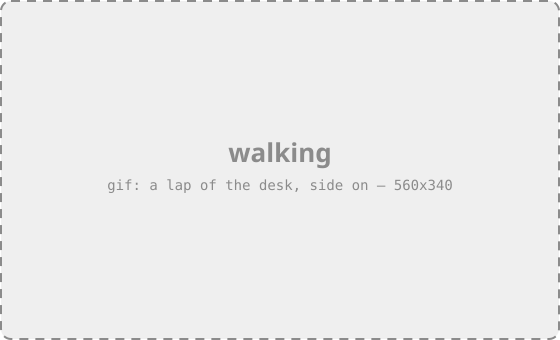
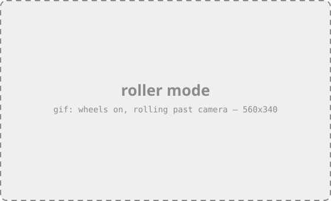
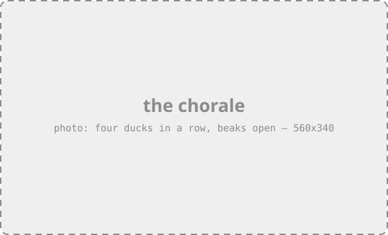
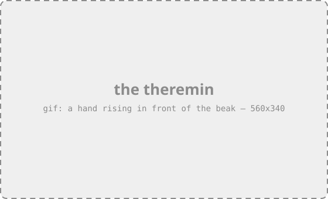

<p align="center">
  
</p>

<h1 align="center">microduck</h1>

<p align="center">
  <em>A duck-sized biped that walks, puts on wheels when it feels like it,<br>
  plays a theremin with your hand, and sings four-part harmony with its friends.</em>
</p>

<p align="center">
  <a href="https://pollen-robotics.com/microduck"><b>pollen-robotics.com/microduck</b></a> ·
  <a href="docs/robot/cheatsheet.md">Cheat sheet</a> ·
  <a href="docs/design/architecture.md">How it works</a> ·
  <a href="CONTRIBUTING.md">Contributing</a>
</p>

<p align="center">
  <a href="https://github.com/pollen-robotics/microduck/actions/workflows/ci.yml"></a>
  <a href="https://github.com/pollen-robotics/microduck/releases"></a>
</p>

---

**This repo is the duck's brain.** A handful of daemons on a Radxa Zero 3W: a 50 Hz control loop
driving fifteen servos from a neural policy, the radios and the camera, and the update machinery
that gets new software onto a robot without bricking it. If you have a microduck, everything you need to run
it is here. If you want one, the [website](https://pollen-robotics.com/microduck) is the place to
start.

## It does things

<table>
<tr>
<td width="50%"></td>
<td width="50%"></td>
</tr>
<tr>
<td><b>It walks.</b> A policy trained in simulation, running on the board — no tether, no laptop in
the loop. Pick up the gamepad and drive.</td>
<td><b>It rolls.</b> Put wheels on it, hold D-pad up for three seconds, and it loads a different
brain: one quack for legs, two for wheels.</td>
</tr>
<tr>
<td></td>
<td></td>
</tr>
<tr>
<td><b>It sings.</b> Ducks in the same room find each other over Bluetooth, work out who takes
which part, and sing in four voices — mouths on the beat, no shared clock, no wires.</td>
<td><b>It plays.</b> The time-of-flight sensor in its head turns your hand's distance into a pitch,
in the duck's own voice, with its beak opening as the note climbs.</td>
</tr>
</table>

It also sits, stands, kicks a ball, rolls forward on command, coos when you scratch its head if
you turn that on, and goes limp before it hits the floor — so a fall costs it some dignity rather
than a gearbox.

<p align="center">
  
</p>

<p align="center"><em>…and it serves its own console: open a browser, see what the duck sees, drive
it from the page.</em></p>

## Say hello

On the robot, over ssh:

```bash
robotctl health      # is it alive, and what is wrong if not
robotctl monitor     # the control loop, live: asked vs applied, joints, battery, temps
robotctl quack        # it answers in a voice that is only its own
```

Switch a paired gamepad on and drive — `padd` runs from boot and waits for one. **Start** enables
the policy; the first press moves the robot to its home pose, so hold it or stand it up.

Every command explains itself, so exploring beats reading:

```bash
robotctl --help
```

## Where to find things

### You have a duck

| | |
|---|---|
| [Cheat sheet](docs/robot/cheatsheet.md) | Every `robotctl` command: drive, configure, voice, chorale, theremin, wifi, updates, logs. Start here. |
| [Pair a gamepad](docs/robot/pair-a-gamepad.md) | Once per pad — and what to do when it will not bond. |
| [`duckctl`](docs/robot/duckctl.md) | The robot from a laptop over Bluetooth, with no network and no ssh. |
| [Updates](docs/robot/cheatsheet.md#updates-updaterd) | Install, roll back, pin. Every update is verified, health-gated and reversible. |

### You are building on it

| | |
|---|---|
| [How it works](docs/design/architecture.md) | The whole system on one page — five daemons, one bus, how an update reaches a robot — then a page per part. |
| [Set up a dev board](docs/robot/install-dev.md) | From a blank board to a robot that takes branch builds. |
| [Dev cheat sheet](docs/robot/cheatsheet-dev.md) | Branch builds, release candidates, driving from a laptop, and the restart traps after an update. |
| [Push your branch](docs/robot/dev-push.md) | Build on your machine, install over ssh, about a minute. |
| [CONTRIBUTING.md](CONTRIBUTING.md) | Building, testing, layout, conventions, releasing. |
| [Docs index](docs/README.md) | Everything, including the design pages and the open problems. |

## Under the hood

Rust, no framework, one workspace. `robotd` owns the control loop and the motor bus; `updaterd`
installs signed releases and rolls them back when a robot comes up unhealthy; `configd` owns wifi
and identity; `btd` is the Bluetooth path a phone uses; `padd` reads the gamepad; `mediad` streams
the camera over WebRTC; `tofd` serves the depth sensor. They talk over one JSON-RPC contract on
Unix sockets, and every client — the app, the console, the gamepad, your script — sends exactly the
same calls.

The interesting decisions are written down rather than folklore:
[`docs/design/`](docs/design/) is why things are the way they are, and
[`docs/project/`](docs/project/) is what has gone wrong and what would close it.

## A note on ducks

No duck was harmed in the making of this robot. Several were consulted.
